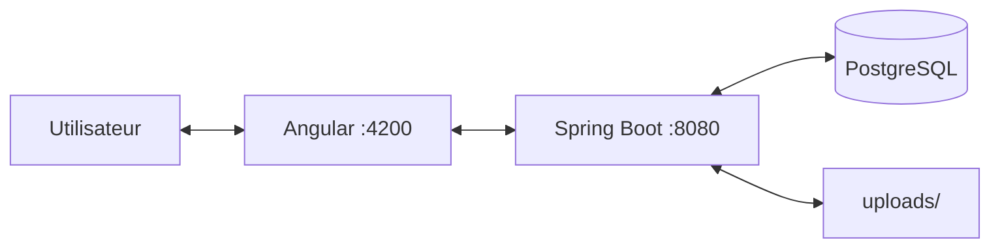

# DataShare documentation

Application de **partage de fichiers temporaire** : lien unique, expiration, mot de passe optionnel, historique pour les utilisateurs connectés.

## Stack technique

| Couche | Technologie | Port |
|--------|-------------|------|
| Frontend | Angular 22 | **4200** |
| Backend | Spring Boot 3.4 / Java 17 | **8080** |
| Base de données | PostgreSQL | **5432** |
| Fichiers | dossier `uploads/` | — |

Swagger : [http://localhost:8080/swagger-ui.html](http://localhost:8080/swagger-ui.html)

## Architecture (vue simple)



**Un flux métier — téléchargement**

1. Destinataire ouvre le lien `/download/{token}`
2. **GET** `/api/files/metadata/{token}` → infos affichées
3. **POST** `/api/files/download/{token}` → fichier (mot de passe si protégé)

!!! note "Alignement doc ↔ code"
    Le binaire se télécharge en **POST**, pas en GET (corrigé suite à la soutenance).

## Documentation

- [Backend](backend.md) — démarrage API, couches, endpoints **métier**
- [Frontend](frontend.md) — démarrage SPA, pages, guards
- [Tests backend](testing-backend.md) — JUnit, JaCoCo ≥ 75 %
- [Tests frontend](testing-frontend.md) — Vitest, Cypress (**compétence 5**)
- [Performance](perf.md) — k6, profils de charge
- [Sécurité](security.md) — JWT, secrets, localStorage
- [Maintenance](maintenance.md) — exploitation, purge, scripts

## Démarrage express

```bash
docker compose up -d db
cd datashare_backend && ./mvnw spring-boot:run
cd datashare_frontend && npm install && npm start
```

