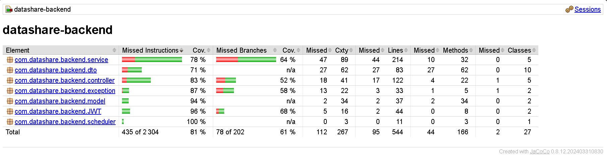

# Tests backend

## Commande

```bash
cd datashare_backend
./mvnw clean test
# Rapport JaCoCo : target/site/jacoco/index.html
```

## Résultat (JaCoCo)



| Indicateur | Valeur |
|------------|--------|
| Instructions (global) | **~81 %** |
| Seuil projet | ≥ **75 %** ✅ |
| Tests | ~60 JUnit/Mockito, **0 échec** |

Packages bien couverts : `JWT`, `scheduler` (100 %), `service`, `controller`.

## Fonctionnalités critiques testées

- Authentification (register / login)
- Upload (validation taille / extension)
- Téléchargement (metadata + POST binaire)
- Purge des fichiers expirés
