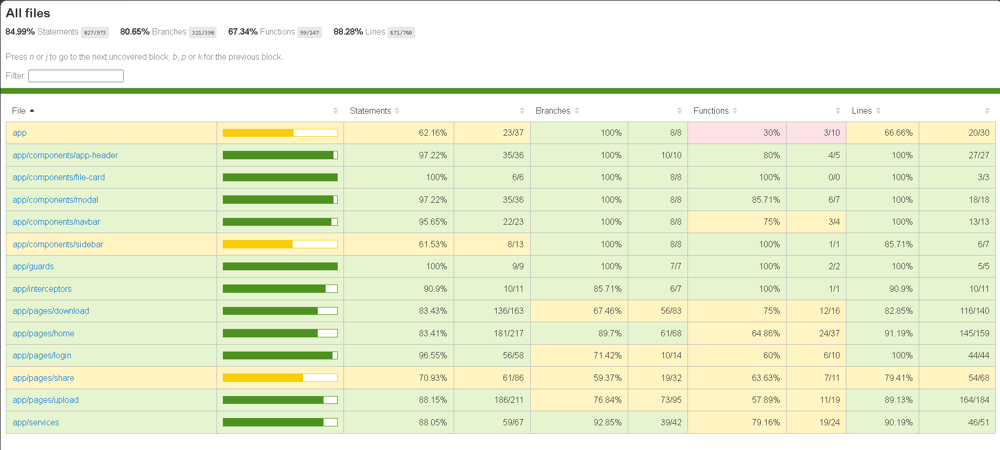
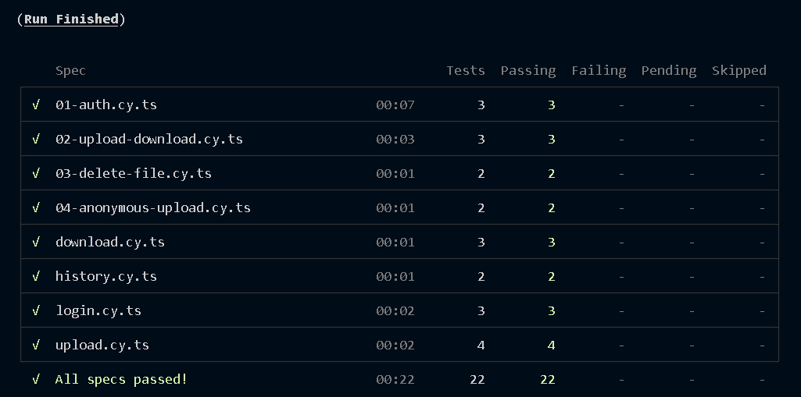

# Plan de Tests — DataShare

## Objectif

Ce document définit la stratégie de test de l’application **DataShare**, couvrant :

- le MVP obligatoire (**US01 à US06**) ;
- les fonctionnalités avancées optionnelles (**US07 à US10**) ;
- les tests unitaires (backend & frontend) ;
- les tests end-to-end (Cypress) ;
- les objectifs de couverture de code.

---

## 1. Périmètre fonctionnel testé

| US | Fonctionnalité | Niveau de test prioritaire |
|----|----------------|----------------------------|
| US01 | Upload authentifié (token, expiration, options) | Unitaire + E2E |
| US02 | Téléchargement via lien + métadonnées | Unitaire + E2E |
| US03 | Création de compte | Unitaire + E2E |
| US04 | Connexion JWT | Unitaire + E2E |
| US05 | Historique des fichiers | Unitaire + E2E |
| US06 | Suppression (physique + base) | Unitaire + E2E |
| US07 | Upload anonyme | Unitaire + E2E |
| US08 | Tags | Unitaire |
| US09 | Mot de passe fichier (hash) | Unitaire + E2E |
| US10 | Expiration automatique + purge | Unitaire |

---

## 2. Tests unitaires

### 2.1 Backend (Spring Boot — JUnit 5 + Mockito + JaCoCo)

Emplacement : `datashare_backend/src/test/java/com/datashare/backend/`

#### AuthService (US03, US04)
- `register()` crée un utilisateur avec email unique et mot de passe hashé
- `register()` rejette un email déjà utilisé
- `login()` retourne un JWT valide pour des identifiants corrects
- `login()` rejette un mot de passe incorrect ou un email inconnu

#### FileService (US01, US05, US06, US07, US08, US10)
- `uploadFile()` génère un token unique non prédictible
- `uploadFile()` associe le fichier à l’utilisateur connecté
- `uploadFile()` accepte `ownerId = null` (anonyme)
- `uploadFile()` refuse extensions interdites et taille > 1 Go
- `normalizeTags()` : max 30 caractères, pas de doublons
- `deleteFileForUser()` supprime physique + métadonnées
- `deleteFileForUser()` refuse la suppression d’un fichier tiers
- `findByUser()` ne retourne que les fichiers du propriétaire
- `purgeExpiredFiles()` supprime les fichiers expirés

#### FileDownloadService (US02, US09)
- `getFileMetadata()` retourne les métadonnées d’un fichier valide
- `getFileMetadata()` rejette un lien expiré ou invalide
- `getFileForDownload()` accepte le mot de passe correct
- `getFileForDownload()` rejette un mot de passe incorrect
- `getFileForDownload()` exige le mot de passe si protégé

#### FileHistoryService (US05)
- `getUserHistory()` retourne l’historique complet
- `getUserHistory()` indique correctement l’état du lien (valide / expiré)

#### Contrôleurs, JWT, exceptions, scheduler
- `AuthController`, `FileController`, `FileDownloadController`, `FileHistoryController`
- `JwtProvider`, `JwtFilter`
- `GlobalExceptionHandler` (mapping HTTP 400 / 401 / 403 / 404 / 410 / 500)
- `ExpiredFileCleanupJob` (US10)
- `ShareService`

#### Exécution

```bash
cd datashare_backend
./mvnw clean test
# Rapport JaCoCo
# target/site/jacoco/index.html
./mvnw jacoco:check   # seuil configuré à 75 % (hors configs Spring pure)
```

### 2.2 Frontend (Angular — Vitest / `ng test`)

Emplacement : `datashare_frontend/src/app/**/*.spec.ts`

#### AuthService
- `login()` → `POST /api/auth/login`
- `register()` → `POST /api/auth/register`
- `saveToken()` / `getToken()` / `logout()` gèrent le `localStorage`
- `isAuthenticated()` retourne `true` si un token existe

#### FileService
- `getFiles()` → `GET /api/files`
- `uploadFile()` construit un `FormData` correct
- `uploadAnonymous()` → `POST /api/files/upload/anonymous`
- `deleteFile()` → `DELETE /api/files/info/{id}`
- `getFileMetadata()` → `GET /api/files/metadata/{token}`
- `downloadFile()` → `POST /api/files/download/{token}`

#### Exécution

```bash
cd datashare_frontend
npm test
npm run test:coverage
# Rapport : coverage/ (selon configuration Vitest / Angular)
```

---

## 3. Tests end-to-end (Cypress)

### 3.1 Outil

**Cypress** — specs dans `datashare_frontend/cypress/e2e/`

Les tests mockent l’API via `cy.intercept` (backend non obligatoire pour la CI front).

### 3.2 Scénarios critiques

#### Scénario 1 — Création de compte et connexion (US03, US04)
Fichier : `01-auth.cy.ts`

1. Ouverture de `/welcome`
2. Navigation vers inscription
3. Email valide + mot de passe ≥ 8 caractères
4. Soumission → compte créé
5. Connexion avec les identifiants
6. JWT stocké dans `localStorage`

**Critère d’acceptation :** token présent et accès à l’espace personnel (`/home`).

#### Scénario 2 — Upload et accès au lien (US01, US02)
Fichier : `02-upload-download.cy.ts`

1. Utilisateur connecté sur `/upload`
2. Sélection d’un fichier et téléversement
3. Lien de téléchargement affiché
4. Fichier visible dans « Mes fichiers »
5. Accès à `/download/:token` + métadonnées
6. Clic sur « Télécharger »

**Critère d’acceptation :** métadonnées visibles ; téléchargement déclenché.

#### Scénario 3 — Suppression (US06)
Fichier : `03-delete-file.cy.ts`

1. Liste « Mes fichiers »
2. Clic « Supprimer » → modale de confirmation
3. Confirmation → appel `DELETE`
4. Modale fermée ; fichier retiré de la liste

**Critère d’acceptation :** confirmation obligatoire ; suppression effective côté API mockée / réelle.

#### Scénario 4 — Upload anonyme (US07)
Fichier : `04-anonymous-upload.cy.ts`

1. `/welcome` → bouton cloud → `/upload`
2. Upload sans JWT
3. Lien de téléchargement généré

### 3.3 Exécution Cypress

```bash
cd datashare_frontend
npm install
npx cypress install

npm start                 # terminal 1
npm run e2e               # UI interactive
npm run e2e:run           # headless
npm run e2e:ci            # start + run automatique
npm run e2e:coverage      # E2E + rapport NYC → coverage-e2e/
```

---

## 4. Critères d’acceptation généraux

| US | Critère |
|----|---------|
| US01 | Fichier uploadé, token unique, expiration 1–7 jours (défaut 7) |
| US02 | Métadonnées avant téléchargement ; téléchargement via token |
| US03 | Email unique, mot de passe ≥ 8 caractères, hash en base |
| US04 | JWT généré et transmis au client |
| US05 | Historique : nom, taille, dates, état du lien |
| US06 | Suppression physique + BDD, confirmation front |
| US07 | Upload sans compte, pas d’historique propriétaire |
| US08 | Tags libres, max 30 car., sans doublon |
| US09 | Mot de passe fichier ≥ 6 car., stocké hashé (BCrypt) |
| US10 | Expiration respectée ; purge planifiée (cron 03:00) |

---

## 5. Objectifs de couverture

| Stack | Outil | Objectif |
|-------|--------|----------|
| Backend | JaCoCo | **≥ 75 %** lignes (hors `SecurityConfig`, `OpenAPIConfig`, `BackendApplication`) |
| Frontend unitaire | Vitest / `ng test --coverage` | **≥ 70 %** services métier prioritaires |
| Frontend E2E | Cypress + NYC | Rapport dans `coverage-e2e/` (parcours US) |

### Rapports

| Rapport | Emplacement |
|---------|-------------|
| JaCoCo | `datashare_backend/target/site/jacoco/index.html` |
| Front unitaire | `datashare_frontend/coverage/` |
| Cypress / NYC | `datashare_frontend/coverage-e2e/index.html` |

> Joindre une capture des rapports de couverture au dossier de livrable de formation.
### Rapport JaCoCo `datashare_backend/target/site/jacoco/index.html`


### Rapport Cypress `datashare_frontend/coverage-e2e/index.html`


### Rapport dans `coverage-e2e/` (parcours US)


---

## 6. Stratégie de mocks

| Couche | Approche |
|--------|----------|
| Unitaire backend | Mockito (`@Mock`, `@InjectMocks`) — pas de DB réelle |
| Unitaire frontend | `HttpClientTestingModule` / `HttpTestingController` |
| E2E Cypress | `cy.intercept` sur `/api/**` (mode CI) ou backend réel (mode intégration) |

---

## 7. Non-régression

Avant chaque livraison :

1. `./mvnw clean test` (backend)
2. `npm test` (frontend unitaire)
3. `npm run e2e:run` (E2E, frontend démarré)
4. Vérifier l’absence de régression sur US01–US06 (smoke manuel optionnel)

---

## 8. Limites connues

- La couverture E2E Istanbul sur **Angular 22 (esbuild)** peut être partielle sans build instrumenté dédié ; les specs Cypress restent la référence pour les parcours utilisateur.
- Les tests unitaires backend n’exigent pas PostgreSQL (Mockito uniquement).
- Les tests E2E « contre backend réel » nécessitent Spring Boot sur `localhost:8080` et la désactivation partielle des intercepts.
